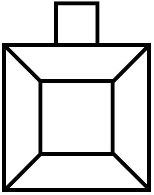
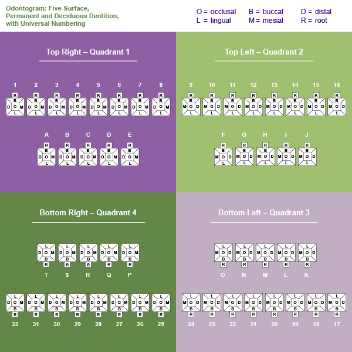
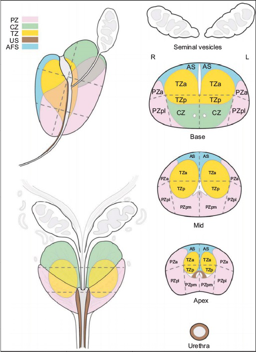
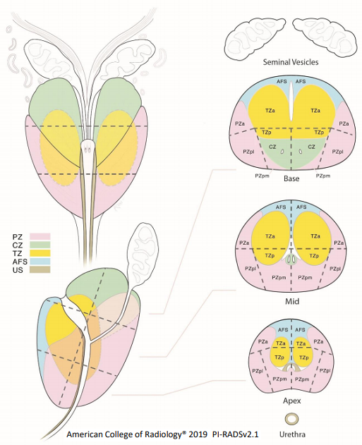
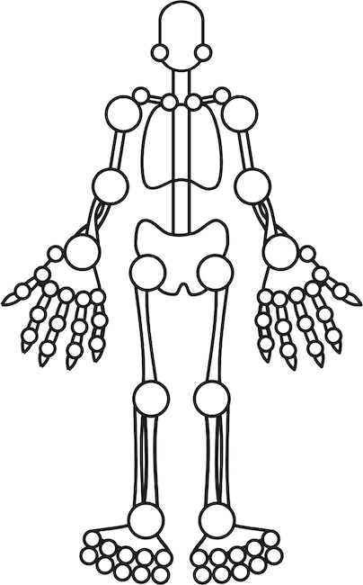
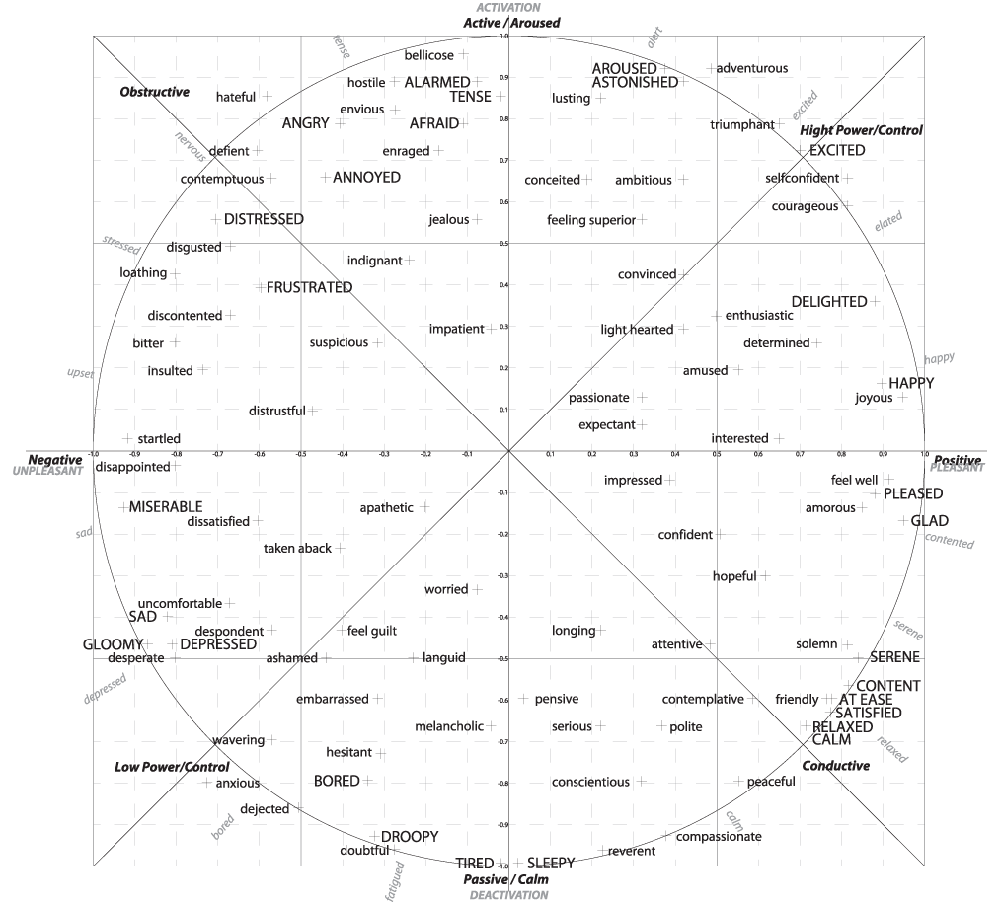
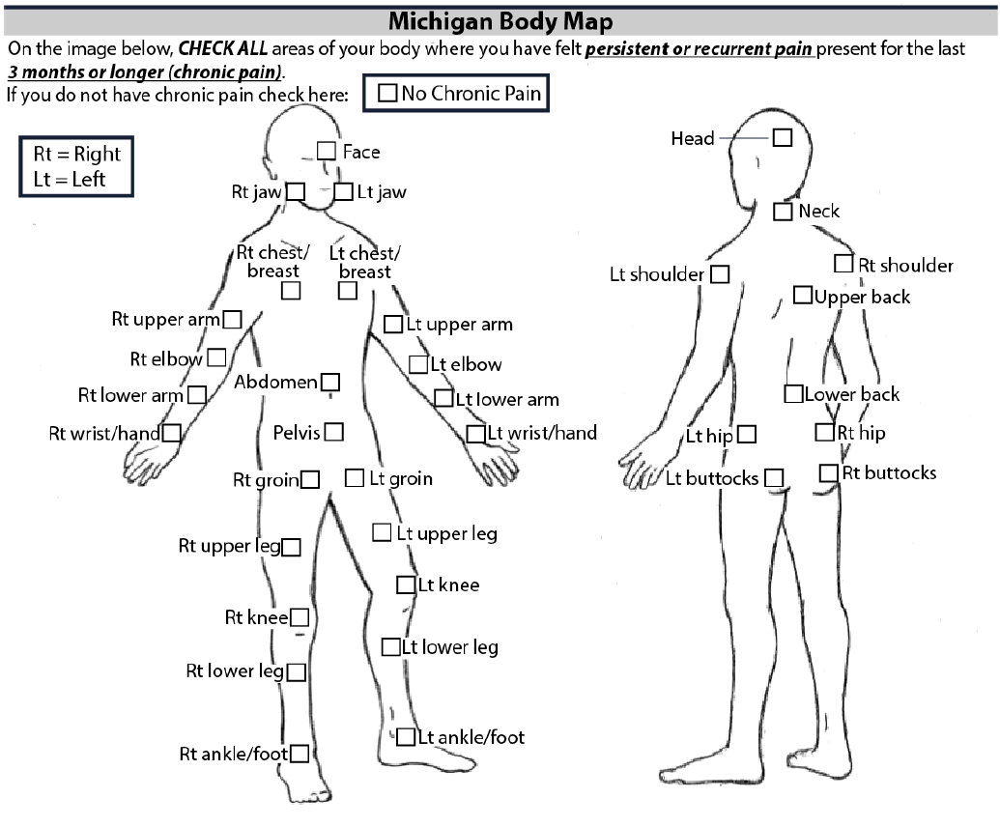
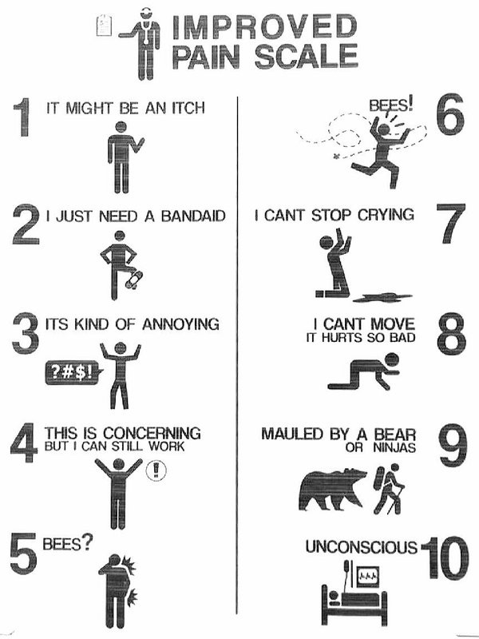
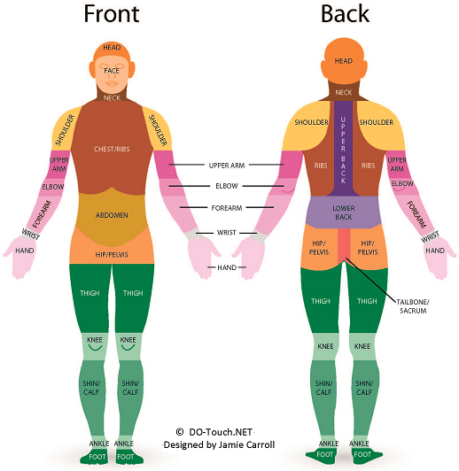
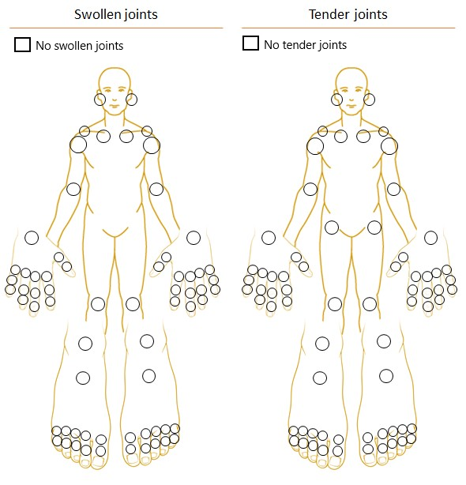

# REDCap module: Image Map


[](https://zenodo.org/badge/latestdoi/115049747)

This REDCap module replaces an input, radio, or checkbox field with an image that users can interact with to select one or more options. Specific applications include a body map (with over 70 body regions), a smile scale from 1-7 with facial expressions, three representations of teeth and teeth surfaces, among others. See below for a complete list of current imagemaps. The module is tied to questions via the `@IMAGEMAP` action tag and the name of one of the pre-defined image maps.  e.g. `@IMAGEMAP=PAINMAP_FEMALE`.


## Prerequisites
- REDCap >= 8.0.3 (for versions < 8.0.3, [REDCap Modules](https://github.com/vanderbilt/redcap-external-modules) is required).


## Easy Installation
- Obtain this module from the Consortium [REDCap Repo](https://redcap.vanderbilt.edu/consortium/modules/index.php) from the control center.


## Manual Installation
- Clone this repo into `<redcap-root>/modules/imagemap_v0.0.0`.
- Go to **Control Center > External Modules** and enable Image Map.
- To activate this module for a particular project, go to the project home page, click on the **External Modules** link, and then enable Image Map for that project.


## Features included
This module defines a new action tag: `@IMAGEMAP`. The possible values for this tag are:


**`PAINMAP_MALE`**

Representation of a generic male body.  


**`PAINMAP_FEMALE`**

Representation of a generic female body.  


**`SMILE_SCALE`**


**`5_FACE_PAINMAP`**


**`SINGLE_TOOTH`**




**`TEETH_SURFACE`**




**`TEETH`**


**`PI-RADS`**




**`PI-RADS_V2-1`**




**`RHEUMATOID_MAN`**

The Rheumatoid man imagemap tool reflects disease activity and progression by recording joint involvement. It was designed for use in paediatric rheumatology, but can be used wherever joint mapping is required.  The Rheumatoid man is in anatomical position, which means a frontal depiction, but not mirrored, i.e., the left hand would be depicted on the right side of the screen.  



**`VA_CHART`**

A 2-D emotion wheel representation of the circumplex model of affect.  



**`MBODY`**

Michigan Body Map (MBM) reflects body areas where chronic pain may be experienced.  



**`BEES (BONUS)`**




**`DO_TOUCH_NET_BODY_COLOUR`** and **`DO_TOUCH_NET_BODY_GREY`**

DO-Touch.NET body region image map designed for use in osteopathic manipulative medicine (OMM) research.



**`66SWOLLEN_68TENDER_JOINT_COUNT`**

The 66 Swollen / 68 Tender Joint Count can be used to record the number of tender and swollen joints in patients with inflammatory arthritis e.g. psoriatic arthritis, rheumatoid arthritis. These counts can be used in calculated fields to generate disease activity scores in combination with other variables e.g. DAPSA, DAS28 scores.



## Usage
To display one of the images above in a survey or data entry form, add a new field of type **Text Box** and include one of the following options in the **Action Tags / Field Annotation (optional)** field:

```
@IMAGEMAP=PAINMAP_MALE
@IMAGEMAP=PAINMAP_FEMALE
@IMAGEMAP=SMILE_SCALE
@IMAGEMAP=5_FACE_PAINMAP
@IMAGEMAP=SINGLE_TOOTH
@IMAGEMAP=TEETH_SURFACE
@IMAGEMAP=TEETH
@IMAGEMAP=PIRADS
@IMAGEMAP=PI-RADS_V2-1
@IMAGEMAP=RHEUMATOID_MAN
@IMAGEMAP=VA_CHART
@IMAGEMAP=MBODY
@IMAGEMAP=BEES
@IMAGEMAP=DO_TOUCH_NET_BODY_COLOUR
@IMAGEMAP=DO_TOUCH_NET_BODY_GREY
@IMAGEMAP=66SWOLLEN_68TENDER_JOINT_COUNT
```

Each region of an image is associated with a key, for example, the "Ankle (front-left)" of the female body diagram is linked to the key "f34". To find a particular key for a body part, please refer to the HTML files (map files) located in the folder `maps`. After selecting multiple body parts, the field containing the action tag `@IMAGEMAP` will have as a value a string of comma-separated keys, e.g. "f36,f17,f18,f21". Similarly, if using the faces diagram, the field containing the action tag (e.g. `@IMAGEMAP=SMILE_SCALE`) will have the value corresponding to the face clicked.


## Testing instrument

This project includes an [Example Instrument](docs/Instrument\ Example.zip) that includes each of these image maps. It demonstrates different methods of using these image maps; which is suitable for testing or demonstration purposes.


## Acknowledgements & Copyright
 * The original body was devised by Dr. Ming-Chih J Kao and Professor Sean Mackey at Stanford University as part of [CHOIR](choir.stanford.edu). Use of the 'bodymap' images requires that the CHOIR attribution remains intact.
 * The imagemap plugin/hook was written at Stanford by Andrew Martin and converted to an external module in collaboration with CTS-IT - University of Florida.
 * The 5-face pain image and map was included by Lewisa2.
 * The odontogram maps were contributed by Bas de Veer and collaborators at the ITHS and Christy McKinney at the University of Washington and Seattle Children’s Research Institute.
 * The PIRADS images were contributed by Dr. Richard Fan from Stanford University. Geoffroey-Allen Franklin gfranklin@atsu.edu provided the new image and mapping for Pirads v2.1.
 * Rheumatoid Man was contributed by Dr. Blaine Vlantis of the University of Cape Town.
 * VA Chart image appears in the paper ["Deep Affect Prediction in-the-Wild: Aff-Wild Database and Challenge, Deep Architectures, and Beyond"](https://link.springer.com/article/10.1007/s11263-019-01158-4) by Kollias, D., Tzirakis, P., Nicolaou, M.A. et al. For image usage, refer to [Springer's copyright information](https://link.springer.com/article/10.1007/s11263-019-01158-4#copyrightInformation).
 * The Michigan Body Map (MBODY) image was created by the Division of Pain Research Anesthesiology of the University of Michigan. Please refer to their [website](https://medicine.umich.edu/dept/pain-research/clinical-research/michigan-body-map-mbm) for copyright information.
 * The DO-Touch.NET body map was created by Jamie Carroll using the international standard for osteopathic manipulative medicine (OMM) research established by DO-Touch.NET. Use of this image map requires the attributions to remain in place. [website](https://www.do-touch.net). Jane Coe Johnson jjohnson@atsu.edu assisted Geoffroey-Allen Franklin gfranklin@atsu.edu updating information about the DO-Touch.NET image maps.
 * The 66 Swollen / 68 Tender Joint Map was contributed by Dr Tom Lynch from the Institute of Bone and Joint Research, University of Sydney. The image was adopted with permission from Dr Alexis Ogdie-Beatty and first published in this article from the OMERACT group: [website](http://www.jrheum.org/content/early/2019/05/24/jrheum.181089).
